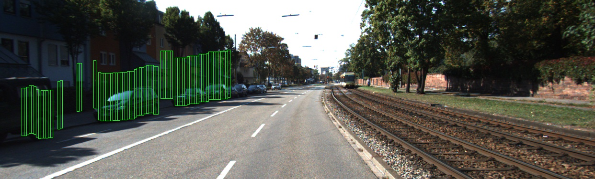
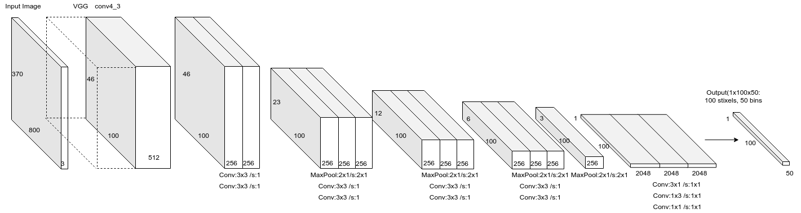
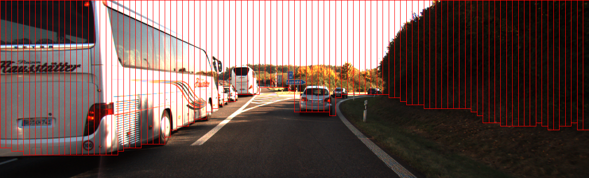

# Obstacle Detection With StixelNet #

## Dependencies ##
- tested on the following environment:
  + OS: tested on Ubuntu 18.04
  + Tensorflow 2.0.0
  + python 3.6
- installing the dependencies:
  + python3 -m pip install -r requirements.txt

## Training Data  ##
### Kitti Raw Dataset ###

### [Ground Truth](https://sites.google.com/view/danlevi/datasets)
- Sample of automatically generated ground truth from velodyne pointclouds


### Downloading the customized dataset for this repository ###

```bash
    python3 ./scripts/download_kitti_stixels.py
```
*the dataset is about 5.4G, so would take sometime until finishing downloading.*

## StixelNet Model ##
***



## Training ##
After downloading the dataset, run
```bash
    python3 ./train.py
```
model weights will be saved into ./saved_models directory

## Test one image ##
***

- Download pretrained model weights with
```bash
    python3 ./scripts/download_kitti_stixels_model_weights.py
```

- Test on an image
```bash
    python3 ./test_single_image.py --model_path [path/to/model/weights]
```

## Sample Result ##
***



## References ##
- [StixelNet: A Deep Convolutional Network for Obstacle Detection and Road Segmentation](http://www.bmva.org/bmvc/2015/papers/paper109/paper109.pdf)
- [Real-time category-based and general obstacle detection for autonomous driving](http://openaccess.thecvf.com/content_ICCV_2017_workshops/papers/w3/Garnett_Real-Time_Category-Based_and_ICCV_2017_paper.pdf)
